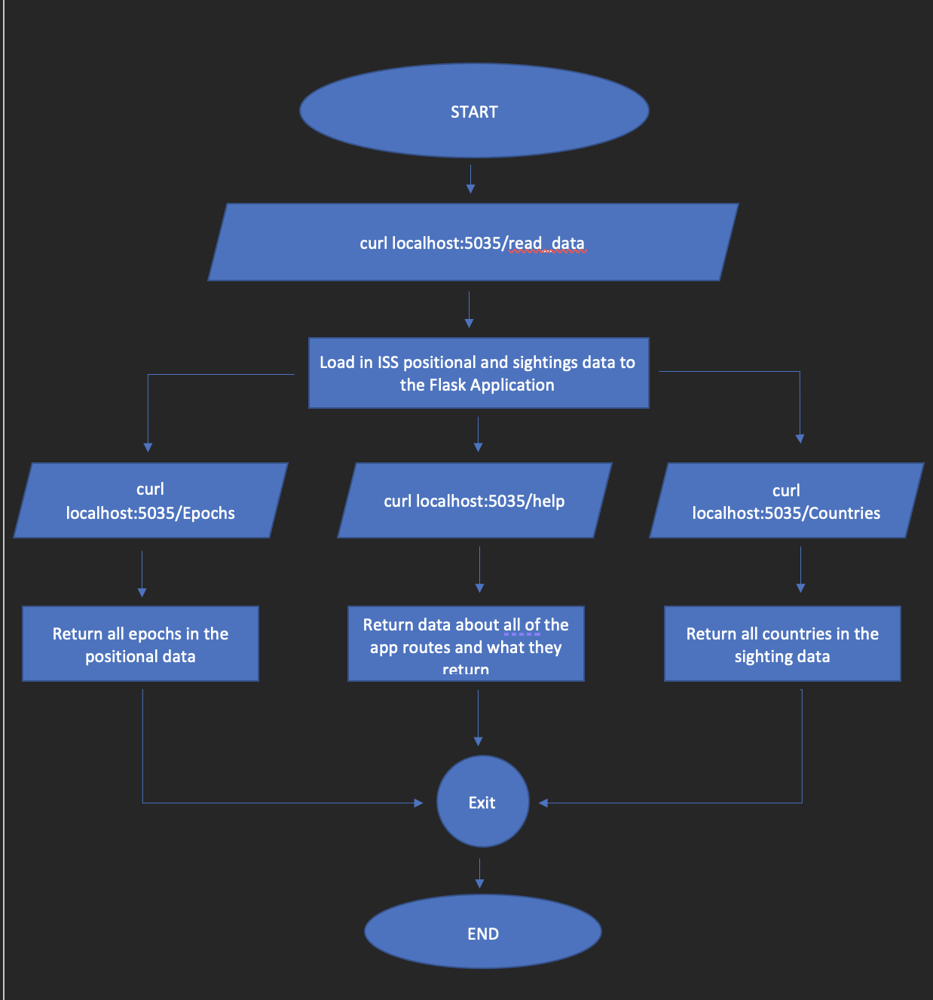

# ISS Position and Sightings App Software Diagram

## Overview
The current directory contains a software diagram, especifically a behavioral diagram, that demonstrates the routes components in the app. The diagram's goal is to easily show the use of the Flask API and the outputs from certain routes when curled.

## Files
### image.png
This image is the software diagram for the ISS Position and Sightings App. Such project can be found using this link: [ISS Position And Sightings App Repository](https://github.com/DavidVenturaDiaz/ISS-position-and-sightings).

## Behavioral Diagram
### Rendered Image

### Description
From the diagram shown above, we observe that to commence utilizing the application, the user must first read in the ISS positional and sighting data. Once that is done, the user can utilize other routes such as `/Epochs`, `/help`, and `/Countires`. From the diagram, we observe the outputs returned by the application onced such routes are curled. You can exit the application by typing 'exit', or using control+C, which will end the application.
